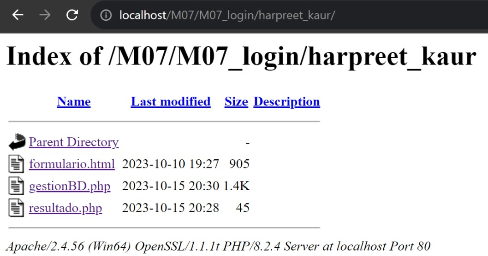
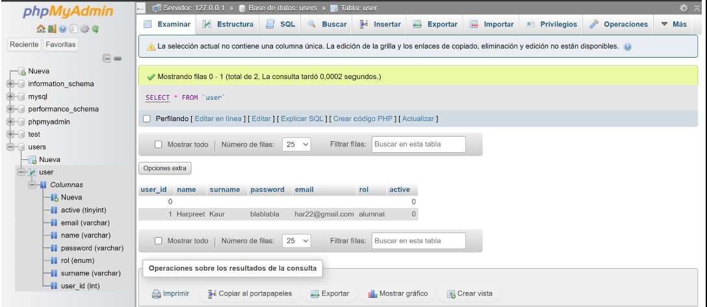
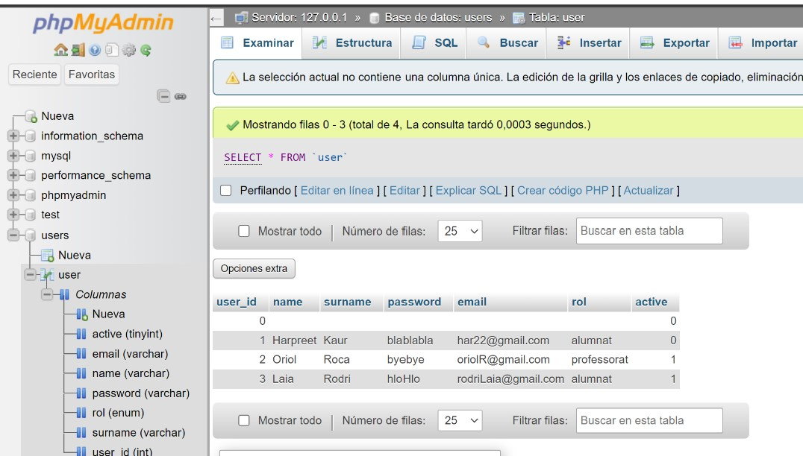

# M07_login

### A través d’un formulari en php (amb totes les etiquetes html en format DOCTYPE) afegir les dades d’usuaris (alumnat i professorat) utilitzant el mètode procedimental.

#### A phpmyadmin, crear una BBDD de nom Users i la taula de nom user.
#### A la taula user, afegir dades d’alumnat i professorat des d’un programa en php connectant-se a la BBDD Users.

#### Captures que s'han demanat en l'enunciat:

