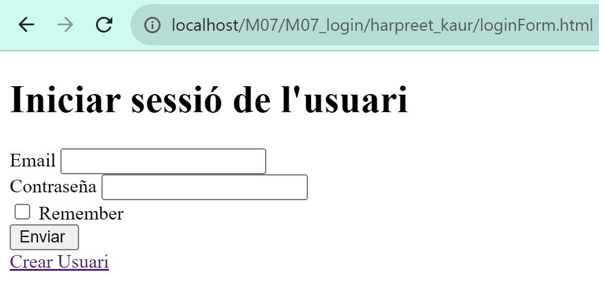
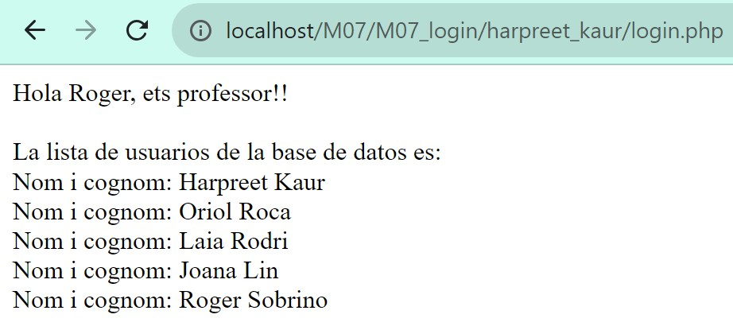
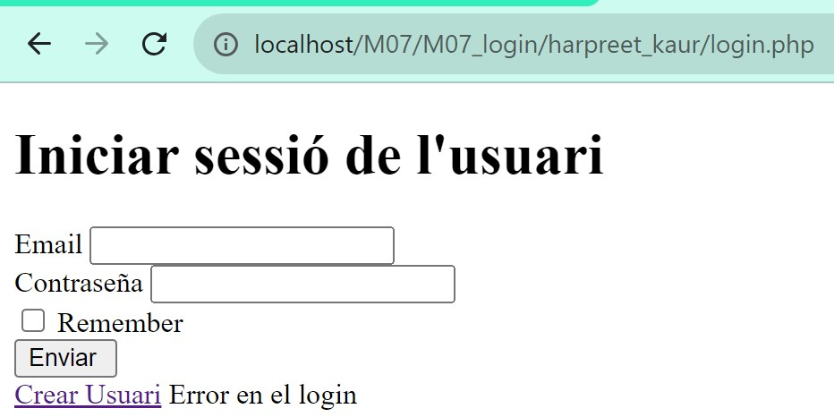

# M07_login

## Sign Up 
### A través d’un formulari en php (amb totes les etiquetes html en format DOCTYPE) afegir les dades d’usuaris (alumnat i professorat) utilitzant el mètode procedimental.

#### A phpmyadmin, crear una BBDD de nom Users i la taula de nom user.
#### A la taula user, afegir dades d’alumnat i professorat des d’un programa en php connectant-se a la BBDD Users.

#### Captures que s'han demanat en l'enunciat:

## Sign In

### Es crea un formulari amb HTML per fer el Login. 
* Serà un formulari amb el mail i el password. 
* Ha de tenir un checkbox “Remember me”
* El formulari haurà de fer servir el mètode POST.
* La pàgina tindrà un enllaç per poder crear un usuari (pàgina de la pràctica anterior)
* Totes les pàgines de la pràctica anterior hauran de tenir un enllaç per anar a login.html

### Per mostrar les dades s'ha de tener en compte el rol de l'usuari. 
### Si el rol és alumnat, es mostra el seu nom, cognom i correo.Si es el rol és professorat es mostren tots els usuari de la base de dades. 

### Captures de panatalla: 

* EL formulari Login: 

* Usuari professorat: 

* Usuari alumnat:

* Dades no correctes: 

